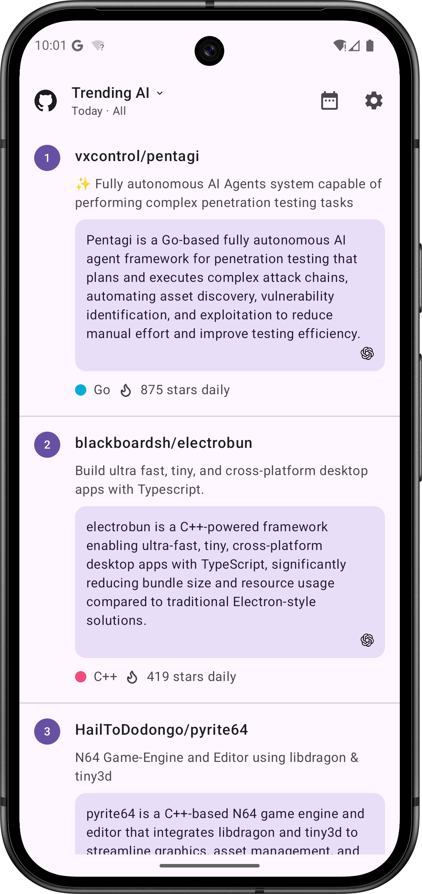

# Trending AI

[中文版本](./README_ZH.md)

> 🚧 **Status: Under Active Development (Work in Progress)**

**Understand GitHub Trending projects quickly with AI.**

*Save time reading long READMEs and source code; efficiently filter and locate high-value open-source projects.*

---

## 📸 Preview

Currently in early preview:

| Android | iOS |
| --- | --- |
|  | *Coming Soon* |

---

## 📖 Introduction

Trending AI is a cross-platform application built with Kotlin Multiplatform (KMP). It allows you to view GitHub's daily, weekly, and monthly trending repository lists and uses Large Language Models (LLMs) to automatically generate concise summaries for each project.

## ✨ Core Features

- 📈 **Comprehensive Trends**: Real-time trending project lists for today, this week, and this month.
- 🤖 **AI Summaries**: Integration with ChatGPT / DeepSeek models to automatically extract core features and logic for each repository.
- 📅 **Historical Records**: Support for querying past lists by date and batch (Morning/Evening reports).
- 📱 **Native Cross-platform**: Built with Compose Multiplatform, supporting both Android and iOS with a single codebase.

---

## 🛠️ Tech Stack

**Kotlin Multiplatform** | **Compose Multiplatform** | **Ktor** | **Material 3**

---

## 📚 Documentation

- [Project Architecture](docs/ARCHITECTURE.md)
- [Icon Creation and Adaptation Guide](docs/ICON_GUIDE.md)

---

## 📈 Stargazers over time

---

## 📄 License

This project is licensed under the MIT License - see the [LICENSE](LICENSE) file for details.
